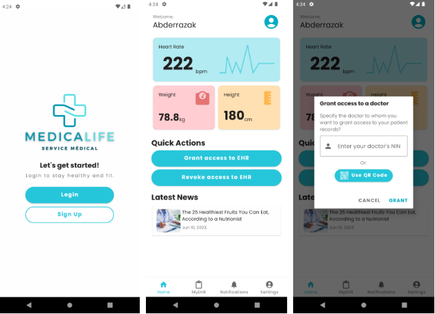

# Contents of /src

You'll find here the source code for our platform devised into 3 folders:

## hospital

This is currently a PoC docker-compose set up that launches the services needed for the hospital internal system in the proposed architecture.

## ministry

\<Work in progress\>

## mobile_app

Currently a designed interface + bare functionalities (Minimal Viable Product) for a patient's mobile e-healthcare application.
